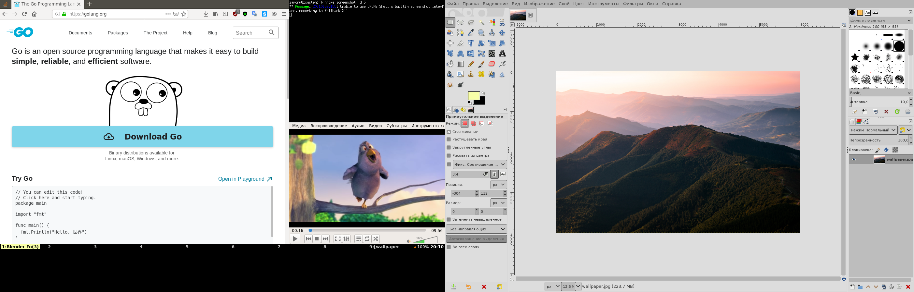

**wmwm** is a pure Go autotiling window manager. It is very simple (2k loc) and uses ~80Mb RAM.

## My dual head setup




## Basics
With wmwm you start with one window which takes full size of the screen. Next window will split screen into equal columns with the second window placed in the right column. Additional windows will be placed in the right column.

Windows in a column always have the same height. You can move windows within the column or from one column to another.

Windows and columns belong to workspaces. In wmwm you have eight workspaces (nine if external monitor is connected). You can easily move windows from one workspace to another.

## What wmwm does have?
+ Auto-tiling
+ Workspaces
+ Support for external monitor
+ Fullscreen mode
+ Window activation with mouse click
+ Two column layouts (50/50, 65/35 in wide)
+ Basic ICCCM support
+ EWMH (_NET_NUMBER_OF_DESKTOPS, _NET_DESKTOP_NAMES, _NET_CURRENT_DESKTOP)

## Installation
Precompiled binary [is available for download](https://github.com/Zamony/wmwm/releases). You can also compile it yourself:
```
git clone https://github.com/Zamony/wmwm.git
go build
```
You also need to update your `~/.xinitrc` adding the following line `exec ./wm` where `./wm` is the path to the compiled binary

## Keybindings
+ ``Win + ` `` - run application launcher (you can set one with `--launcher`)
+ `Win + t` - run terminal emulator
+ `Win + q` - close window
+ `Ctrl + Win + Right` `Ctrl + Win + Left`- make column bigger/smaller if possible
+ `Win + Up` `Win + Down` `Win + Left` `Win + Right` - change focus to up/down/left/right
+ `Win + Alt + Up` `Win + Alt + Down` `Win + Alt + Left` `Win + Alt + Right` - move window up/down/left/right
+ `F1..F9` - activate workspace
+ `Win + F1..F9` - move window to specified workspace
+ `Win + f` - activate fullscreen mode
+ `Ctrl + Alt + Backpace` - terminate window manager

## Configuration
Configuration is done via command line arguments:
```
  -border-width     Border width of focused window
  -color            Background and border color (ex. "0xdedede")
  -debug            Outputs debug information to Stderr
  -exec value       Commands to execute at startup
  -launcher         A command to show application launcher (default "rofi -show run")
  -lock string      A command to lock screen (default "slock")
  -name-limit       Maximum length of workspace name
  -padding-bottom   Value of bottom padding (useful for panels and bars)
  -padding-top      Value of top padding (useful for panels and bars)
  -term string      A command to launch terminal emulator (default "xterm")
```
You may want to use panel or status bar with wmwm. I use tint2 with the configuration file available [here](https://gist.github.com/Zamony/a2440eb20dbc530a2d0380909738566e)